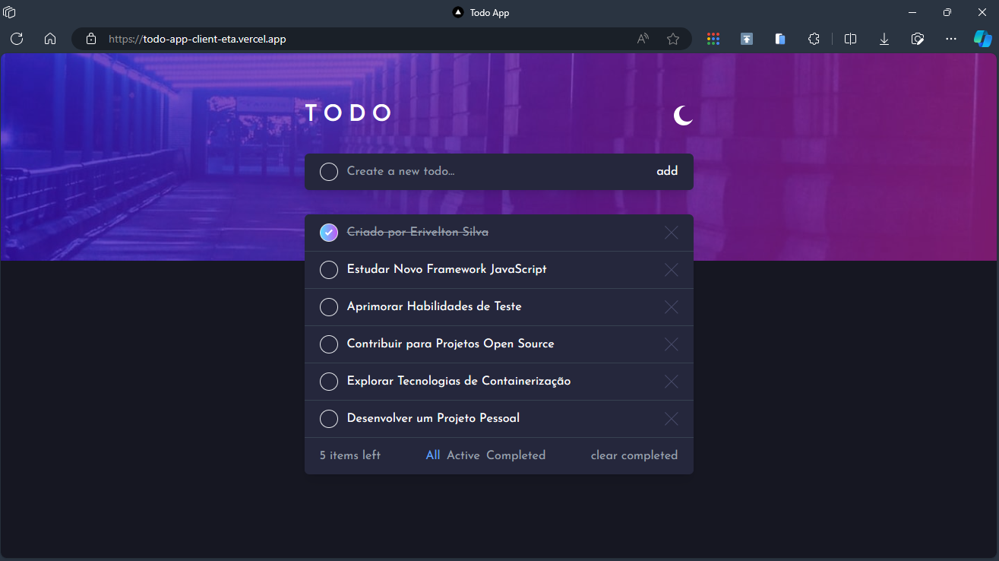
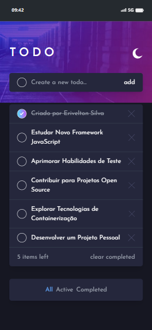

# <center>TODO APP</center>

O To-Do App é uma aplicação simples e eficiente para gerenciar suas tarefas diárias. Desenvolvido utilizando Node.js para o backend e React para o frontend, o aplicativo oferecerá uma experiência intuitiva e responsiva para ajudar os usuários a organizarem suas listas de afazeres de forma prática.

<br>

## Screenshot




<br>

## Estrutura do Projeto

O projeto é dividido em duas partes principais: o `server` (backend) e o `client` (frontend).

<br>

## Backend

O backend é construído usando Node.js e Express para fornecer APIs e gerenciar a lógica de negócios.

### Tecnologias Utilizadas

- Node.js
- Express
- Typescript
- Ts-node
- Banco de Dados: sqlite com o prisma.js

### Configuração do Ambiente

Instale as dependências do backend usando o seguinte comando:

```bash
npm install
```

Configure as variáveis de ambiente necessárias no arquivo .env.

Inicie o servidor backend:

```bash
npm run dev
```

O servidor estará disponível em http://localhost:3000 (ou outra porta especificada no arquivo .env).

<br>

## Frontend

O frontend é construído usando React para criar uma interface de usuário interativa.

### Tecnologias Utilizadas

- React
- TypeScript
- Vite
- Bibliotecas: ...

### Configuração do Ambiente

Instale as dependências do frontend usando o seguinte comando:

```bash
npm install
```

Configure as variáveis de ambiente necessárias no arquivo .env.

### Inicie o servidor frontend:

```bash
npm run dev
```

O aplicativo estará disponível em http://localhost:3001 (ou outra porta especificada no arquivo .env).

<br>

## Andamento Atual do Projeto

O projeto encontra-se em fase inicial, com foco prioritário no desenvolvimento do backend. Até o momento, foram realizados os seguintes progressos:

### Backend

- **Configuração do Ambiente:** Todas as dependências do backend foram instaladas com sucesso, e o ambiente de desenvolvimento está configurado adequadamente.

- **Estrutura Básica:** Foi estabelecida a estrutura inicial do servidor usando Node.js e Express. Os principais pontos, como rotas e manipulação básica de dados, estão implementados.

- **Integração com Banco de Dados:** A conexão com o banco de dados sqlite através do prisma.js foi configurada, preparando o backend para lidar com o armazenamento e recuperação de dados das tarefas.

- **APIs Principais:** Foram definidas as APIs principais para leitura, adição, atualização e exclusão de tarefas. Essas APIs serão essenciais para a interação futura com o frontend.

### Frontend

Neste momento, o desenvolvimento do frontend ainda não foi iniciado. Concentrou-se, por hora, em consolidar e otimizar a lógica de negócios no backend antes de avançar para a camada de interface do usuário.

## Próximos Passos

Os próximos passos do projeto incluirão:

1. **Desenvolvimento do Frontend:** Iniciar a construção da interface do usuário utilizando React e TypeScript. Serão implementadas as funcionalidades essenciais de interação com o usuário.

2. **Refinamento da Interface:** Aprimorar a experiência do usuário por meio de melhorias visuais e de usabilidade.

3. **Implementação de Recursos Adicionais:** Adicionar recursos avançados, como categorização de tarefas e filtros, para aprimorar a eficácia do aplicativo.

<br>

## Contribuição

Sinta-se à vontade para contribuir com melhorias, novas funcionalidades ou correções de bugs. Basta seguir o seguinte processo:

1. Faça um fork do repositório.

2. Crie uma branch para sua feature:

```bash
git checkout -b feature/nome-da-feature
```

3. Desenvolva sua feature e faça commit das alterações:

```bash
git commit -m "Adiciona nova feature"
```

4. Faça push da branch para o seu fork:

```bash
git push origin feature/nome-da-feature
```

5. Abra um pull request no repositório original.

<br>
 
## Contato

Para dúvidas ou sugestões, entre em contato pelo email eriveltondasilva13@gmail.com.
